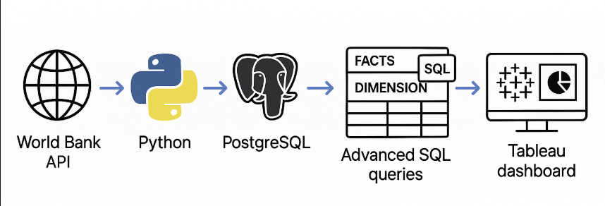

Global Sustainability Analytics - a complete data pipeline project

Data was extracted from the World Bank API using Python and processed into structured format. The pipeline separates data into fact and dimension tables to support analytical modeling and was written into a PostgreSQL database.

The PostgreSQL instance was then connected to Tableau for dashboard development and visual exploration. Advanced SQL queries were used to derive insights and prepare data for visualization.

📁 Project Components:
Python ETL Script: Extracts World Bank indicators and loads them into PostgreSQL.
(See: ExtractDataFromAPI.ipynb)
Advanced SQL Queries: Details of queries and transformations performed in PostgreSQL. 
Tableau Dashboard Screenshots: Tableau dashboards created to highlight insights, patterns and trends.
